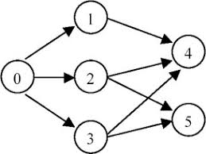

### 127. Topological Sorting
Given an directed graph, a topological order of the graph nodes is defined as follow:

For each directed edge A -> B in graph, A must before B in the order list.
The first node in the order can be any node in the graph with no nodes direct to it.
Find any topological order for the given graph.

**Example**

For graph as follow:




The topological order can be:

>[0, 1, 2, 3, 4, 5]

>[0, 2, 3, 1, 5, 4]


**Challenge**

Can you do it in both BFS and DFS?

**Clarification**

Learn more about representation of graphs

**Notice**

You can assume that there is at least one topological order in the graph.

```java
/*
Description
Given an directed graph, a topological order of the graph nodes is defined as follow:

For each directed edge A -> B in graph, A must before B in the order list.
The first node in the order can be any node in the graph with no nodes direct to it.
Find any topological order for the given graph.

Notice
You can assume that there is at least one topological order in the graph.

Clarification
Learn more about representation of graphs

Example
For graph as follow:

picture：
https://encrypted-tbn0.gstatic.com/images?q=tbn:ANd9GcThE9AgZZszyhwe0o9qpp3VyizdIj9kWwMY50HiQEysXvkSLsoZ

The topological order can be:
[0, 1, 2, 3, 4, 5]
[0, 2, 3, 1, 5, 4]
...

Challenge
Can you do it in both BFS and DFS?

Tags
LintCode Copyright Geeks for Geeks Depth First Search Topological Sort Breadth First Search
 */

/**
 * 拓扑排序 被用于对 有向无环图 进行排序。
 * 它常被用于 Build System 等场合，比如 Java 中有很多个包，
 * 每个包都它各自的依赖，比如 C 依赖于 A 和 B，那么在 A,B 被建立之前，C 是无法被创建的。
 * 那 IDE 如何知道这件事呢？这就使用到了 拓扑排序了。
 *
 * 这里提供的是基于 HashMap 来实现的模板，适用范围更广，相应的运行效率也会比较低。
 * 通常情况下，我们可以使用 List/Array 来替代实现。
 *（本题中因为信息由 DirectedGraphNode 类给出，所以使用 HashMap 会更好写）
 * 基于 List/Array 的拓扑排序模板：
 *  https://github.com/cherryljr/LintCode/blob/master/Course%20Schedule%20II.java
 *
 * 参考资料：
 * https://www.youtube.com/watch?v=ddTC4Zovtbc
 * https://www.geeksforgeeks.org/topological-sorting-indegree-based-solution/
 */

/**
 * Approach 1: BFS
 * 首先我们知道 有向图 的每个节点具有 出度 和 入度 两个值。
 * 而为了实现 拓扑排序 我们需要使用到 入度，这个值。
 * 当一个节点 拥有 1个 入度，代表其拥有一个依赖，也就意味着：在它的依赖完成之前，它无法被完成。（应该排在后面）
 * 
 * 具体做法为：
 *  1. 首先我们可以遍历整个图的 边。
 *  将各个节点的 入度 计算出来，并保存在 HashMap 中。
 *  2. 然后我们遍历整个图的 节点。将 入度为0 的节点加入到 queue 和 rst 中。
 *  （最开始情况下 入度为0 的节点代表一开始就没有任何依赖，可以最先被完成）
 *  3. 然后我们利用 queue 进行 BFS，
 *  每当从队列中 poll 一个元素出来，我们就从图中移除 它 和 它对应的边。
 *  代表它已经完成，这就意味着以它为 入度 的节点的入度将会减少，并且有可能为 0.
 *  在遍历过程中，当一个节点的 入度为0 就意味着它的依赖已经被全部完成了，那么它就可以被完成，
 *  所以将它 add 到 queue 和 rst 中。
 * 
 * 时间复杂度：
 * 我们总共需要遍历 3 次图（计算入度 + 得到入度为0的点 + BFS）
 * 因此总体时间复杂度为：O(n)
 */

/**
 * Definition for Directed graph.
 * class DirectedGraphNode {
 *     int label;
 *     ArrayList<DirectedGraphNode> neighbors;
 *     DirectedGraphNode(int x) { label = x; neighbors = new ArrayList<DirectedGraphNode>(); }
 * };
 */
public class Solution {
    /*
     * @param graph: A list of Directed graph node
     * @return: Any topological order for the given graph.
     */
    public ArrayList<DirectedGraphNode> topSort(ArrayList<DirectedGraphNode> graph) {
        if (graph == null || graph.size() == 0) {
            return new ArrayList<>();
        }

        // 遍历图的边，计算各个节点的 入度
        Map<DirectedGraphNode, Integer> indegreeMap = new HashMap<>();
        for (DirectedGraphNode node : graph) {
            for (DirectedGraphNode neigh : node.neighbors) {
                indegreeMap.put(neigh, indegreeMap.getOrDefault(neigh, 0) + 1);
            }
        }

        ArrayList<DirectedGraphNode> rst = new ArrayList<>();
        Queue<DirectedGraphNode> queue = new LinkedList<>();
        for (DirectedGraphNode node : graph) {
            // 选出 入度为0 的节点，将其 add 到 queue 和 rst 中
            if (!indegreeMap.containsKey(node)) {
                queue.offer(node);
                rst.add(node);
            }
        }

        // BFS
        while (!queue.isEmpty()) {
            DirectedGraphNode curr = queue.poll();
            // 移除 curr 节点以及对应的 边
            for (DirectedGraphNode neigh : curr.neighbors) {
                indegreeMap.put(neigh, indegreeMap.get(neigh) - 1);
                // 如果 入度为0 就意味着它的依赖已经被全部完成了，那么它就可以被完成，
                // 所以将它 add 到 queue 和 rst 中
                if (indegreeMap.get(neigh) == 0) {
                    queue.offer(neigh);
                    rst.add(neigh);
                }
            }
        }

        return rst;
    }
}

/**
 * Approach 2: DFS
 * 拓扑排序同样也能通过 DFS 来实现。
 * 具体做法为：
 *  准备一个 Stack 和 Set.
 *  Stack 用来存储 DFS 获得的结果，visited(Set) 用来标记已经遍历过的节点。
 *  然后我们从一个节点开始，首先将它加入 visited 中。
 *  然后通过 节点的边(neighbors) 检查相邻的其他节点，
 *  如果存在 neighbors（还未被遍历过）, 那么继续递归遍历 neighbors, 否则就将其加入 stack 中。
 *  最后我们将 stack 中的元素弹出，就是我们需要的答案了。
 *
 * 时间复杂度为：O(n) 只需要遍历一遍即可
 *
 * 推荐观看：https://www.youtube.com/watch?v=ddTC4Zovtbc
 */
public class Solution {
    /*
     * @param graph: A list of Directed graph node
     * @return: Any topological order for the given graph.
     */
    public ArrayList<DirectedGraphNode> topSort(ArrayList<DirectedGraphNode> graph) {
        if (graph == null || graph.size() == 0) {
            return new ArrayList<>();
        }

        Stack<DirectedGraphNode> stack = new Stack<>();
        // Record the visited node
        Set<DirectedGraphNode> visited = new HashSet<>();
        for (DirectedGraphNode node : graph) {
            if (visited.contains(node)) {
                continue;
            }
            topSortHelper(node, visited, stack);
        }

        ArrayList<DirectedGraphNode> rst = new ArrayList<DirectedGraphNode>();
        while (!stack.isEmpty()) {
            rst.add(stack.pop());
        }
        return rst;
    }

    private void topSortHelper(DirectedGraphNode node, Set<DirectedGraphNode> visited, Stack<DirectedGraphNode> stack) {
        // add the curr node into the visited set
        visited.add(node);
        for (DirectedGraphNode neigh : node.neighbors) {
            if (visited.contains(neigh)) {
                continue;
            }
            topSortHelper(neigh, visited, stack);
        }
        // if the curr node don't have any neighbors or all the neighbors have been visited
        // put it into stack
        stack.push(node);
    }
}
```