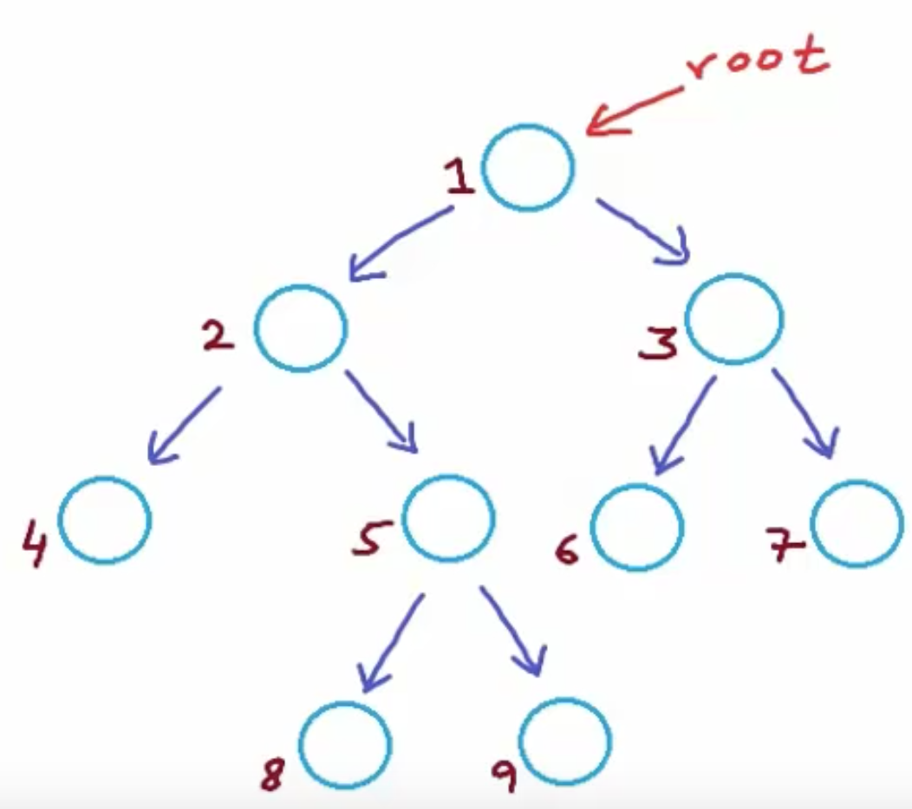

# 二叉树基础知识 Part 1

## definition

二叉树是每个节点最多只有两个分支的树结构，其分支被称为左子树和右子树，并且分支具有顺序，不能颠倒。


- 二叉树的第 i 层最多有 2^(i-1) 个节点。（此时根节点为第一层）
- 深度为 k 的二叉树最多有 2^(k+1) - 1 个节点。（此时根节点所在的深度为0）
- 二叉树可以为空，但普通树不可以。

### 满二叉树

深度为 k 的二叉树有 2^(k+1) - 1 个节点（此时根节点所在的深度为0）的二叉树。


### 完全二叉树

深度为 k 有 n 个节点的二叉树，当且仅当其中的每一节点，都可以和同样深度 k 的满二叉树，序号为 1 到 n 的节点一对一对应的二叉树。

翻译一下是：叶节点只能出现在最下层和次下层，并且最下面一层的结点都集中在该层最左边的若干位置的二叉树。


### 二叉树的表示方法(Java)

``` java
class TreeNode {
  public int val;
  public TreeNode left, right;
  public TreeNode(int val) {
    this.val = val;
    this.left = this.right = null;
  }
}
```

### 二叉树的高度

- 高度(height)：二叉树的高度是指 root 节点到最长叶子结点的**边数**。
- 深度(depth)：二叉树的深度是指 root 节点到最长叶子结点的**节点数**。

例如：


这棵树最远的叶子结点是 8 或者 9，因此该树的高度是 3，而深度是4。

要求二叉树的高度，可以递归求左子树的高度，右子树的高度，取两者高度的最大值，再加上 root 到左右子树的边数，即 1，就是整棵树的高度。递归的出口条件是，当 `node==null` 时，即说明以这个节点为 root 节点的树高度为 0，所以当 `node==null` 时返回 0。


``` java
int height(TreeNode node) {
  if (node == null) {
    return 0;
  }
  return Math.max(height(node.left), height(node.right)) + 1;
}
```

非递归的写法可以用层序遍历来实现。

### 平衡二叉树

平衡二叉树是指一颗二叉树的**所有左右子树**高度之差小于等于1。一颗空树是高度平衡的。

判断一棵树是不是平衡二叉树：

``` java
boolean isBalanced(TreeNode root) {
  if (root == null) {
    return true;
  }
  int l = height(root.left);
  int r = height(root.right);
  if (Math.abs(l-r) > 1) {
    return false;
  }
  if (!isBalanced(root.left) || !isBalanced(root.right)) {
    return false;
  }
  return true;
}
```

### 二叉搜索树(BST)

二叉搜索树是指所有左子树的节点值小于根节点，所有右子树的节点值大于根节点的二叉树。


#### 在 BST 中查找节点

``` java
TreeNode search(TreeNode root, int key) {
  if (root == null || root.val == key) {
    return root;
  }
  if (root.val < key) {
    return search(root.right, key);
  }
  if (root.val > key) {
    return search(root.left, key);
  }
  return null;
}
```

#### 向 BST 中插入节点

根据 BST 的性质：所有左子树节点值小于根节点值，所有右子树节点值大于根结点值，并且没有重复节点。因此不难发现，新加入的节点只能在叶子结点的位置被插入。

``` java
TreeNode insert(TreeNode root, int value) {
  if (root == null) {
    root = new TreeNode(value);
    return root;
  }
  if (root.val < value) {
    root.right = insert(root.right, value);
  }
  if (root.val > value) {
    root.left = insert(root.left, value);
  }
  return root;
}
```

#### 在 BST 中删除节点

在 BST 中删除节点可以分为以下几步：

- 查找到需要删除的节点 delNode。
- 根据 delNode 拥有的子节点数分情况讨论：
  - 没有子节点：直接删除 delNode。
  - 有一个子节点：将这个子节点的值复制给 delNode，并删除子节点。
  - 有两个子节点：找到 delNode 的继承人，将继承人的值复制给 delNode，再删除继承人节点。

其中，根据 BST 的特性，要满足比左子树都大，比右子树都小，那么继承人将出现在右子树中最小的节点，这个节点在右子树的最左下方。

``` java
Node deleteNode(Node root, int key) {
  if (root == null) {
     return root;
  }
  if (root.key < key) {
    root.right = deleteNode(root.right, key);
  } else if (root.key > key) {
    root.left = deleteNode(root.left, key);
  } else {
    if (root.left == null && root.right == null) {
      root = null;
    } else if (root.left == null && root.right != null) {
      root = root.right;
    } else if (root.right == null && root.left != null) {
      root = root.left;
    } else if (root.left != null && root.right != null) {
      int min = findMin(root);
      root.key = min;
      root.right = deleteNode(root.right, root.key);
    }
  }
  return root;
}

int findMin(Node root) {
  int min = root.key;
  while (root.left != null) {
    min = root.left.key;
    root = root.left;
  }
  return min;
}
```

#### 求 BST 的最小公共祖先

由于 BST 的特性，在 BST 中求两个节点的最小公共祖先([LCA](https://en.wikipedia.org/wiki/Lowest_common_ancestor))可以变得很简单。可以根据两个节点的值与根结点的大小比较而得出这两个节点在左子树还是右子树。

- 如果两个节点分别位于左子树和右子树，那么其最小公公祖先就是根结点。
- 如果两个节点同时位于左子树，那么递归左子树查找。
- 如果两个节点同时位于右子树，那么递归右子树查找。

``` java
public TreeNode lowestCommonAncestor(TreeNode root, TreeNode p, TreeNode q) {
  if (root == null) return root;

  if (p.val < root.val && q.val < root.val) {
    return lowestCommonAncestor(root.left, p, q);
  } else if (p.val > root.val && q.val > root.val) {
    return lowestCommonAncestor(root, p, q);
  } else {
    return root;
  }
}
```