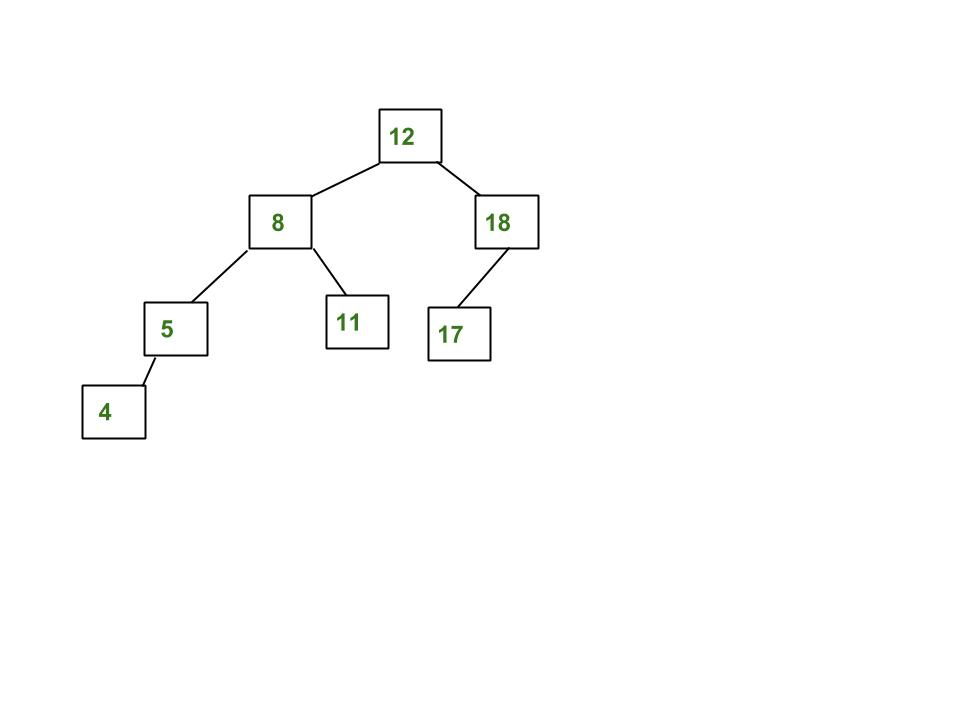

# 二叉树基础知识 Part 2

## 红黑树(red-black tree)

具有以下性质的被定义为红黑树：

- 每个节点有红或黑两种颜色属性。
- 根节点是黑色属性。
- 相邻两个节点的颜色不能同是红色，即红色节点的父节点和子节点都不能是红色。
- 每一条从根节点到 NULL 节点路径所经历的黑色节点数相同。


## AVL 树

AVL 树是一颗平衡的 BST。


## 遍历二叉树

### 前序遍历(Preorder)

前序遍历：`根左右`。例如这样一棵树遍历的结果是[1, 2, 4, 5, 3]


``` java
List<Integer> Preorder(TreeNode root) {
  List<Integer> result = new ArrayList<>();
  if (root == null) return result;

  Stack<TreeNode> stack = new Stack<>();
  stack.push(root);

  while (!stack.isEmpty()) {
    TreeNode curr = stack.pop();
    result.add(curr.val);

    if (curr.right != null) {
      stack.push(curr.right);
    }
    if (curr.left != null) {
      stack.push(curr.left);
    }
  }
  return result;
}
```

### 中序遍历(Inorder)

中序遍历：`左根右`。例如这样一棵树遍历的结果是[4, 2, 5, 1, 3]


``` java
List<Integer> Inorder(TreeNode root) {
  List<Integer> result = new ArrayList<>();
  if (root == null) return result;

  Stack<TreeNode> stack = new Stack<>();

  TreeNode curr = root;
  while (curr != null) {
    stack.push(curr);
    curr = curr.left;
  }

  while (!stack.isEmpty()) {
    curr = stack.pop();
    result.add(curr.val);

    if (curr.right != null) {
      curr = curr.right;
      while (curr != null) {
        stack.push(curr);
        curr = curr.left;
      }
    }
  }
  return result;
}
```

### 后序遍历(Preorder)

后序遍历：`左右根`。例如这样一棵树遍历的结果是[4, 5, 2, 3, 1]


``` java

```