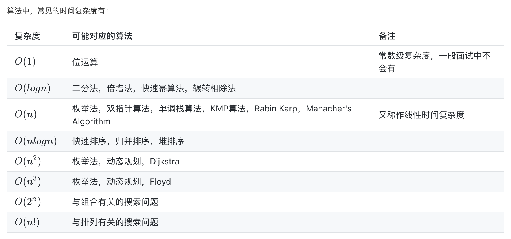

# 二分法

## 时间复杂度

时间复杂度定义了一段程序执行消耗的时间，也可以通俗的理解为程序执行了多少语句。它只包含多项式的最高次项，且不包含多项式最高次项的系数。



- 可以用时间复杂度倒推算法，如`O(logN)`的算法几乎可以确定是二分法。

## 递归

- 理解递归的方式是一层一层地剥开，类似于盗梦空间这样。
- 实现递归的时候只需要考虑当前这一层与下一层的关系，以及递归出口(即最里面那一层发生了什么)。
- 递归的三要素：
  1. 递归的定义
  2. 递归的拆解
  3. 递归的出口
- 递归是非常耗费空间的，也最容易产生`stack overflow`的错误，因为执行递归的时候会开辟大量空间，包括每一层参数的空间，以及返回值的空间。

### Fibonacci 数列

`0, 1, 1, 2, 3, 5, 8, 13, 21, ...`，类似于这样第三个数的值是前两个数之和的数列。

注意，以下解法并不是最优解法。

``` java
// 1. 递归的定义：函数接受什么样的参数，返回什么样的值，代表什么意思
public int fibonacci(int n) {
  // 3. 递归的出口：最里面一层是什么情况
  if (n <= 2) {
    return n - 1;
  }
  // 2. 递归的拆解：递归的一种表现公式
  return fibonacci(n - 1) + fibonacci(n - 2);
}
```

### 二分法的递归写法

二分查找的递归深度是`O(log(N))`。

``` java
public findTarget(int[] nums, int target) {
  if (nums == null || nums.length == 0) {
    return -1;
  }
  return binarySearch(nums, 0, nums.length - 1, target);
}

int binarySearch(int[] nums, int start, int end, int target) {
  if (start > end) {
    return -1;
  }

  int mid = (start + end) / 2;
  if (nums[mid] == target) {
    return mid;
  }
  if (nums[mid] < target) {
    return binarySearch(nums, mid + 1, end, target);
  }
  if (nums[mid] > target) {
    return binarySearch(nums, start, mid - 1, target);
  }
  return -1;
}
```

## 尾递归

- 定义：在递归函数中，递归调用的是整个函数的最后的语句，且它的返回值不属于表达式的一部分时，这个递归调用就是尾递归。
- 特点：在递归展开后，该函数可以不等子函数直接完，自己直接销毁，这样就不再占内存。一个递归深度为 `O(n)`的尾递归函数，可以做到只占用`O(1)`的空间。这样就极大优化了栈空间的利用。

但要注意，这种内存优化是由编译器决定是否要采取的，不过大多数现代的编译器会利用这种特点自动生成优化的代码。在实际工作当中，尽量写尾递归函数，是很好的习惯。
而在算法题当中，计算空间复杂度时，建议还是老老实实地算空间复杂度了，尾递归这种优化提一下也是可以，但别太在意。

## 二分法模版

``` java
public int findPosition(int[] nums, int target) {
  if (nums == null || nums.length == 0) {
    return -1;
  }

  int start = 0, end = nums.length - 1;
  while (start + 1 < end) {
    int mid = start + (end - start) / 2;
    if (nums[mid] == target) {
      return mid;
    }
    if (nums[mid] < target) {
      start = mid;
    }
    if (nums[mid] > target) {
      end = mid;
    }
  }

  if (nums[start] == target) {
    return start;
  }
  if (nums[end] == target) {
    return end;
  }
  return -1;
}
```

### 三步翻转法

一个在某个位置旋转过的数组，使之恢复原样。

原数组：[4, 5, 1, 2, 3]

=> [5, 4, 1, 2, 3]

=> [5, 4, 3, 2, 1]

=> [1, 2, 3, 4, 5]

相关题目：
http://www.lintcode.com/problem/recover-rotated-sorted-array/

### 快速幂算法

相关题目：
https://www.lintcode.com/problem/powx-n/description

### 辗转相除法

辗转相除法， 又名欧几里德算法， 是求最大公约数的一种方法。它的具体做法是：用较大的数除以较小的数，再用除数除以出现的余数（第一余数），再用第一余数除以出现的余数（第二余数），如此反复，直到最后余数是0为止。如果是求两个数的最大公约数，那么最后的除数就是这两个数的最大公约数。

相关题目：
http://www.lintcode.com/problem/greatest-common-divisor/